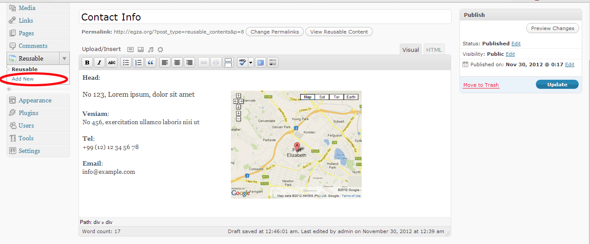

wordpress-reusable-contents
===========================

Some contents and information must appear at different places of blog or web site,
you need to copy/paste and duplicate contents, "Reusable Contents" helps you to control all in one place.
The idea of this plugin is like signature at the end of emails.
You can create any contents that includes images, HTML, shortcodes or event other "Reusable Contents",... and reuse them (by generated shortcode) in in posts, pages, widgets,...
It saves you a lot of times by managing resuable contents.
You can export "Reusable Contents" by using WordPress Export and Import options.

### Suggested uages

*   Announcements
*   Information
*   Advertisements
*   Testimonials
*   Contact information
*   Post Signatures
*   HTML, CSS, Javascript block of code

### Screenshots

### Installation

1. Upload Reusable Contents to the /wp-content/plugins/ directory
2. Activate the plugin through the 'Plugins' menu in WordPress

### Meta

Plugin Name: Reusable Contents
Description: Add unlimited Reusable Contents, Snippets, images, HTML, block of code to use in posts, pages, widgets as easy as emails signature. No more duplicate contents, create once and reuse.
Version: 0.1
